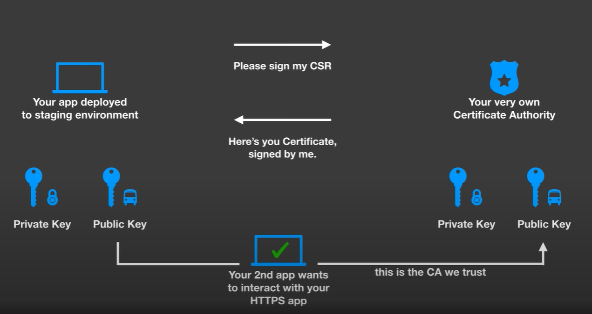

# Security

## OAuth 2.0, OpenID Connect and SAML

### The Differences Between Standards

The main differentiator between these three players is that `OAuth 2.0 is a framework that controls authorization` to a protected resource such as an application or a set of files, while `OpenID Connect and SAML are both industry standards for federated authentication`. That means that OAuth 2.0 is used in fundamentally different situations than the other two standards (examples of which can be seen below), and can be used simultaneously with either OpenID Connect or SAML.

Using either OpenID Connect or SAML independently, enterprises can achieve user authentication and deploy single sign-on. Though they both deal with logins, they have different strengths and weaknesses.

- `OpenID Connect` is built on the OAuth 2.0 protocol and uses an additional `JSON Web Token` (JWT), called an ID token, to standardize areas that OAuth 2.0 leaves up to choice, such as scopes and endpoint discovery. It is specifically focused on user authentication and is widely used to `enable user logins on consumer websites and mobile apps`.
- `SAML` is independent of OAuth, relying on an exchange of messages to authenticate in `XML SAML` format, as opposed to JWT. It is more commonly used to help `enterprise users sign in to multiple applications using a single login`.

### Usecases

`OAuth 2.0`: If you’ve ever signed up to a new application and agreed to let it automatically source new contacts via Facebook or your phone contacts, then you’ve likely used OAuth 2.0. This standard provides secure delegated access. That means an application can take actions or access resources from a server on behalf of the user, without them having to share their credentials. It does this by `allowing the identity provider (IdP) to issue tokens to third-party applications with the user’s approval`.

`OpenID Connect`: If you’ve used your Google to sign in to applications like YouTube, or Facebook to log into an online shopping cart, then you’re familiar with this authentication option. OpenID Connect is an open standard that organizations use to authenticate users. `IdPs use this so that users can sign in to the IdP, and then access other websites and apps without having to log in or share their sign-in information`.

`SAML`: You’ve more likely experienced SAML authentication in action in the work environment. For example, it enables you to log into your corporate intranet or IdP and then access numerous additional services, such as Salesforce, Box, or Workday, without having to re-enter your credentials. SAML is an XML-based standard for `exchanging authentication and authorization data between IdPs and service providers to verify the user’s identity and permissions, then grant or deny their access to services`.

IMAGES:

OAUTH 2.0

OPENID CONNECT

SAML

## identity federation

Traditionally, applications running outside Google Cloud have used service account keys to access Google Cloud resources. Service account keys are powerful credentials, and can represent a security risk if they are not managed correctly.

With identity federation, you can use Identity and Access Management (IAM) to `grant external identities IAM roles, including the ability to impersonate service accounts`. This lets you access resources directly, using a short-lived access token, and eliminates the maintenance and security burden associated with service account keys.

## Workload identity pools

You can use a workload identity pool to `organize and manage external identities`.

A project can contain multiple workload identity pools, and each pool can have access to different resources. This lets you follow the principle of least privilege by grouping related identities in the same pool, and then granting them fine-grained access to resources.

In general, we recommend creating a new pool for each non-Google Cloud environment that needs to access Google Cloud resources, such as development, staging, or production environments.

## Workload identity providers

A workload identity provider is an entity that describes a relationship between `Google Cloud and an external identity provider`. Example providers include:

- AWS
- Azure Active Directory
- On-premises Active Directory
- Okta
- Kubernetes clusters

Workload identity federation follows the `OAuth 2.0 token exchange specification`. You provide a `credential from an external identity provider to the Security Token Service`, which `verifies the identity on the credential, and then returns a federated token in exchange`.

## Let's Encrypt

### How it Works

The objective of Let’s Encrypt and the ACME (Automatic Certificate Management Environment) protocol is to make it possible to `set up an HTTPS server` and have it `automatically obtain a browser-trusted certificate`, without any human intervention. This is accomplished by `running a certificate management agent` on the web server.

To understand how the technology works, let’s walk through the process of setting up `https://example.com/` with a certificate management agent that supports Let’s Encrypt.

There are two steps to this process. First, `the agent proves to the CA that the web server controls a domain`. Then, the `agent can request, renew, and revoke certificates for that domain`.

> Certbot is a free and open-source utility mainly used for managing SSL/TLS certificates from the Let's Encrypt certificate authority

### Domain Validation

Let’s Encrypt identifies the server administrator by public key. The first time the agent software interacts with Let’s Encrypt, it generates a new key pair and proves to the Let’s Encrypt CA that the server controls one or more domains. This is similar to the traditional CA process of creating an account and adding domains to that account.

To kick off the process, the agent asks the Let’s Encrypt CA what it needs to do in order to prove that it controls example.com. The Let’s Encrypt CA will look at the domain name being requested and issue one or more sets of challenges. These are different ways that the agent can prove control of the domain. For example, the CA might give the agent a choice of either:

- Provisioning a DNS record under example.com, or
- Provisioning an HTTP resource under a well-known URI on `http://example.com/`

Along with the challenges, the Let’s Encrypt CA also provides a nonce that the agent must sign with its private key pair to prove that it controls the key pair.

The agent software completes one of the provided sets of challenges. Let’s say it is able to accomplish the second task above: it creates a file on a specified path on the `http://example.com` site. The agent also signs the provided nonce with its private key. Once the agent has completed these steps, it notifies the CA that it’s ready to complete validation.

Then, it’s the CA’s job to check that the challenges have been satisfied. The CA verifies the signature on the nonce, and it attempts to download the file from the web server and make sure it has the expected content.

If the signature over the nonce is valid, and the challenges check out, then the agent identified by the public key is authorized to do certificate management for example.com. We call the key pair the agent used an “authorized key pair” for `example.com`.

### Process

Overall gist

- letsEncrypt challenger process
- certficate issuing
- renewal process

Detailed process

- certbot have to run behind the domain to prove that we own it
- certbot will issue a certificate challenge from letsEncrypt 
- letsEncrypt will ask us to place a file behind the domain over the path(example.com/.well-known/acme-challenge)
- letsEncrypt will issue a nonce(SIGN: 9cf0b331) and certbot will issue a file and sign the nonce
- then it will let the CA know we are done and the certificate will issued to the certbot

Examples:

Youtube Scenario

How Certified CA works

How Self Signed CA works

## CertManager - k8s

Process

- certmanager lives in the k8s cluster.
- we need to wire it up with a certificate authority issuer like LetsEncrypt, vault etc in yaml file.
  - issuers is yaml file will deploy to define CA's (letsEncrypt)
  - cert-manager will generate a CERTIFICATE REQUEST object 
  - then an ORDER object will be generated used for the LetsEncrypt certificate order.
  - then an CHALLENGE object will be generated used to fulfill the letsEncrypt challenge (we need a ingress controller that accepts public traffic to fulfill this incoming web requests for the letsEncrypt challenge).
  - when the challenge is fulfilled the cert-manager then the certificate status is automatically completed and the k8s secret is created or updated.
- we simply ask a certificate using a yaml file where our domain is mentioned along with secret where our certificate to be stored in.
- the cert-manager will talk to the CA and place the new certificate in specified k8s secret
- the cert-manager will also replace the k8s secret with a new one when it's about to expire
- this means free and automatic certificate generation and full lifecycle management

## Links

- [letsencrypt](https://letsencrypt.org/how-it-works/)
- [certbot](https://certbot.eff.org/)
- [cert-manager](https://cert-manager.io/docs/)